# _hvsrpy_ - A Python package for horizontal-to-vertical spectral ratio processing

> Joseph P. Vantassel, [jpvantassel.com](https://www.jpvantassel.com/)

## Table of Contents

-   [About _hvsrpy_](#About-hvsrpy)
-   [Why use _hvsrpy_](#Why-use-hvsrpy)
-   [A Comparison of _hvsrpy_ with _Geopsy_](#A-comparison-of-hvsrpy-with-Geopsy)
-   [Getting Started](#Getting-Started)
-   [Additional Comparisons between _hvsrpy_ and _Geopsy_](#Additional-Comparisons-between-hvsrpy-and-Geopsy)
    -   [Multiple Windows](#Multiple-Windows)
    -   [Single Window](#Single-Window)

## About _hvsrpy_

`hvsrpy` is an open-source Python package for performing horizontal-to-vertical
spectral ratio (HVSR) processing of microtremor and earthquake recordings.
`hvsrpy` was developed by [Joseph P. Vantassel](https://www.jpvantassel.com/)
with contributions from Dana M. Brannon under the supervision of Professor
Brady R. Cox at The University of Texas at Austin. _hvsrpy_ continues to be
developed and maintained by [Joseph P. Vantassel and his research group at Virginia Tech](https://geoimaging-research.org/).

If you use `hvsrpy` in your research or consulting, we ask you please cite the
following:

> Joseph Vantassel. (2020). jpvantassel/hvsrpy: latest (Concept). Zenodo.
> [http://doi.org/10.5281/zenodo.3666956](http://doi.org/10.5281/zenodo.3666956)

_Note: For software, version specific citations should be preferred to
general concept citations, such as that listed above. To generate a version
specific citation for `hvsrpy`, please use the citation tool on the `hvsrpy`
[archive](http://doi.org/10.5281/zenodo.3666956)._

`hvsrpy` implements the work of many others. Therefore we strongly encourage
users to cite the original work alongside `hvsrpy`. Below we list key features
and their associated citation.

Lognormal statistics and fully-automated frequency-domain window-rejection algorithm.

> Cox, B. R., Cheng, T., Vantassel, J. P., & Manuel, L. (2020). "A statistical
> representation and frequency-domain window-rejection algorithm for single-station
> HVSR measurements. Geophysical Journal International, 221(3), 2170–2183.
> https://doi.org/10.1093/gji/ggaa119

Statistical approach to incorporate azimuthal variability.

> Cheng, T., Cox, B. R., Vantassel, J. P., and Manuel, L. (2020). "A
> statistical approach to account for azimuthal variability in single-station
> HVSR measurements." Geophysical Journal International, 223(2), 1040–1053.
> https://doi.org/10.1093/gji/ggaa342

Statistical approach to incorporate spatial variability.

> Cheng, T., Hallal, M. M., Vantassel, J. P., and Cox, B. R., (2021).
> "Estimating Unbiased Statistics for Fundamental Site Frequency Using
> Spatially Distributed HVSR Measurements and Voronoi Tessellation.
> J. Geotech. Geoenviron. Eng. 147, 04021068.
> https://doi.org/10.1061/(ASCE)GT.1943-5606.0002551

SESAME clarity and reliability criteria for microtremor HVSR.

> SESAME. (2004). Guidelines for the Implementation of the H/V Spectral Ratio
> Technique on Ambient Vibrations Measurements, Processing, and Interpretation.
> European Commission - Research General Directorate, 62, European Commission -
> Research General Directorate.

Computation of HVSR under the diffuse field assumption.

> Sánchez-Sesma, F.J., Rodríguez, M., Iturrarán-Viveros, U., Luzón, F.,
> Campillo, M., Margerin, L., García-Jerez, A., Suarez, M., Santoyo, M.A.,
> Rodríguez-Castellanos, A. (2011). A theory for microtremor H/V spectral
> ratio: application for a layered medium: Theory for microtremor H/V spectral
> ratio. Geophysical Journal International 186, 221–225.
> https://doi.org/10.1111/j.1365-246X.2011.05064.x

Power spectral density (PSD) calculation.

> Welch, P., (1967). The use of fast Fourier transform for the estimation
> of power spectra: a method based on time averaging over short, modified
> periodograms. IEEE Transactions on audio and electroacoustics, 15(2), pp.70-73.

New high noise model (NHNM) and new low noise model (NLNM).

> Peterson, J., (1993). Observation and Modeling of Seismic Background
> Noise (Open-File Report No. 93–322). U.S. Geologic Survey, Albuquerque, New Mexico.

`hvsrpy` would not exist without the help of many others. As a
display of our gratitude, we thank them individually
[here](https://github.com/jpvantassel/hvsrpy/blob/main/thanks.md).

## Why use _hvsrpy_

`hvsrpy` contains features not currently available in any other commercial or
open-source software, including:

-   Support of a broad range of microtremor and earthquake data formats
including: miniSEED, SAF, MiniShark, SAC, GCF, and PEER.
-   Multiple methods to combine the horizontal components including: arithmetic_mean, squared-average, quadratic-mean, geometric-mean, total-horizontal-energy, vector-summation, maximum-horizontal-value,
rotD50, or single-azimuth.
-   Ability to use a lognormal distribution for the site resonant
frequency (`fn`) so the uncertainty in `fn` can be represented consistently
in frequency and period.
-   Direct access to the raw HVSR data from each time window and azimuth
(i.e., not only the mean/median curve) through Python objects and
cross-platform text-based output format.
-   Calculate statistics on `fn` that incorporates azimuthal
variability.
-   Ability to develop rigorous and unbiased spatial statistics to
combine spatially distributed HVSR measurements.
-   Multiple automated window rejection algorithms including the
frequency-domain window-rejection algorithm by Cox et al. (2020).
-   Automated checking of the SESAME (2004) peak reliability and clarity
criteria.
-   A command line interface (CLI) for parallel batch-style processing
using multiprocessing.

### Example output from `hvsrpy` when considering the geometric-mean of the horizontal components

|                    | Lognormal Median | Lognormal Standard Deviation |
|--------------------|------------------|------------------------------|
| Site Frequency, fn | 0.67             | 0.09                         |
| Site Period, Tn    | 1.50             | 0.09                         |

### Example output from `hvsrpy` when considering azimuthal variability

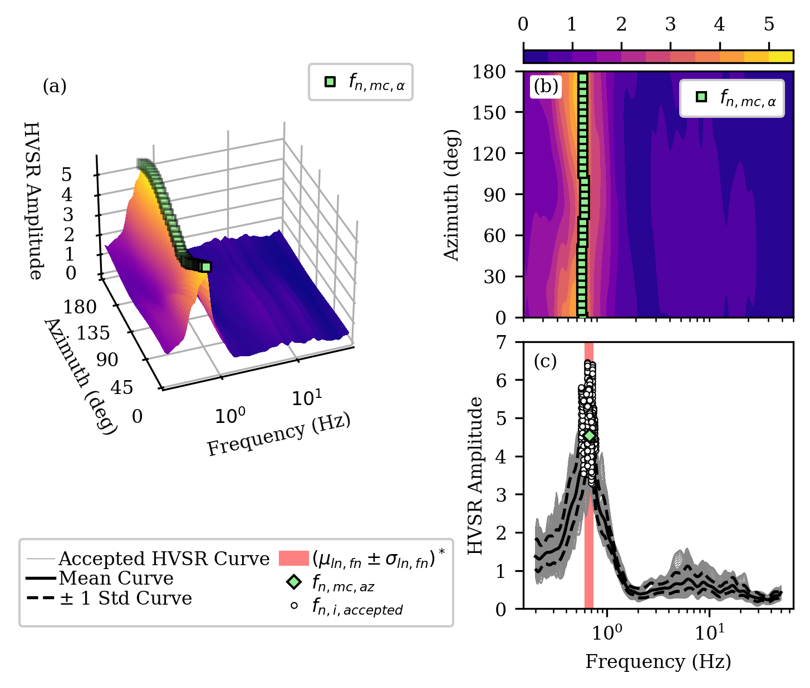

|                       | Lognormal Median | Lognormal Standard Deviation |
|-----------------------|------------------|------------------------------|
| Site Frequency, fn,az | 0.67             | 0.07                         |
| Site Period, Tn,az    | 1.50             | 0.07                         |

### Example output from `hvsrpy` when considering spatial variability

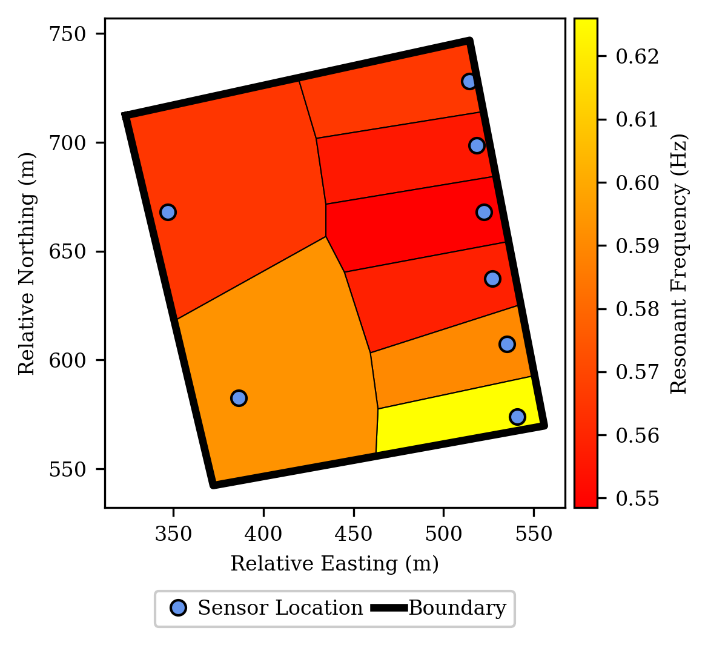

|                       | Lognormal Median | Lognormal Standard Deviation |
|-----------------------|------------------|------------------------------|
| Site Frequency, fn,xy | 0.58             | 0.15                         |
| Site Period, Tn,xy    | 1.74             | 0.15                         |

## A comparison of _hvsrpy_ with _Geopsy_

Some of the functionality available in `hvsrpy` overlaps with the popular
open-source software `geopsy`. Therefore, to encourage standardization, wherever
their functionality coincides we have sought to ensure consistency. Two such
comparisons are shown below. One for a single time window (top) and one for
multiple time windows (bottom). Additional examples are provided at the end of
this document. Additional examples and the code to reproduce all of the
examples shown are provided in the
[gallery](https://github.com/jpvantassel/hvsrpy/tree/main/gallery).

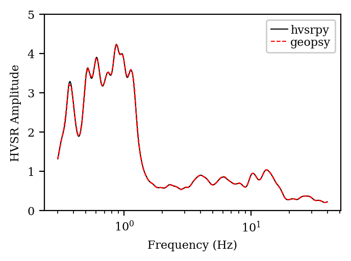

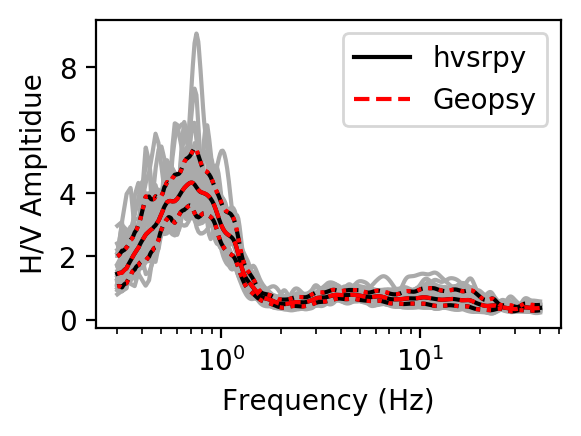

## Getting Started

### Installing or Upgrading _hvsrpy_

1.  If you do not have Python 3.8 or later installed, you will need to do
so. A detailed set of instructions can be found
[here](https://jpvantassel.github.io/python3-course/#/intro/installing_python).

2.  If you have not installed `hvsrpy` previously, you can install it with
`pip` via the command `pip install hvsrpy`.
If you are not familiar with `pip`, a useful tutorial can be found
[here](https://jpvantassel.github.io/python3-course/#/intro/pip). If you have
an earlier version and would like to upgrade to the latest version of `hvsrpy`
use `pip install hvsrpy --upgrade`.

3.  Confirm that `hvsrpy` has installed/updated successfully by examining the
last few lines of the text displayed in the console.

### Using _hvsrpy_

1.  Download the contents of the [examples](https://github.com/jpvantassel/hvsrpy/tree/main/examples) directory to any location of your choice.

2.  Launch the Jupyter notebook (`example_mhvsr_traditional.ipynb`) in the examples
  directory for a no-coding-required introduction to the basics of the `hvsrpy`
  package. If you have not installed `Jupyter Lab`, detailed instructions can be
  found [here](https://jpvantassel.github.io/python3-course/#/intro/installing_jupyter).

3.  Continue to explore the other example notebooks provided. Note that each
  example notebook seeks to highlight one or two key features of `hvsrpy` and
  it may be helpful to combine multiple components together to build
  a custom workflow, this is highly encouraged.

4.  Enjoy!

### Looking for more information

More information regarding HVSR processing and `hvsrpy` can be found
[here](https://github.com/jpvantassel/hvsrpy/blob/main/additional_information.md)
and in the softwares documentation
[here](https://hvsrpy.readthedocs.io/en/latest/?badge=latest).

## Additional Comparisons between _hvsrpy_ and _Geopsy_

### Multiple Windows

The examples in this section use the same settings applied to different
noise records. The settings are provided in the __Settings__ section and the
name of each file is provided above the corresponding figure in the __Results__
section. The noise records (i.e., _.miniseed_ files) are provided in the
[examples](https://github.com/jpvantassel/hvsrpy/tree/main/examples) directory
and also as part of a large published data set
[(Cox and Vantassel, 2018)](https://www.designsafe-ci.org/data/browser/public/designsafe.storage.published//PRJ-2075/Thorndon%20Warf%20(A2)/Unprocessed%20Data/Microtremor%20Array%20Measurements%20(MAM)).

#### Settings

- __Window Length:__ 60 seconds
- __Bandpass Filter:__ No
- __Tukey Window Length:__ 10% (i.e., 5% in Geopsy)
- __Konno and Ohmachi Smoothing Coefficient:__ 40
- __Resampling Center Frequencies:__
    - __Minimum:__ 0.3 Hz
    - __Maximum:__ 40 Hz
    - __Number:__ 2048
    - __Type:__ 'log'
- __Method for Combining Horizontal Components:__ 'squared-average'
- __Distribution for f0 from Time Windows:__ 'normal'
- __Distribution for Mean Curve:__ 'lognormal'

#### Multiple Window Results

__File Name:__ _UT.STN11.A2_C50.miniseed_

__File Name:__ _UT.STN11.A2_C150.miniseed_

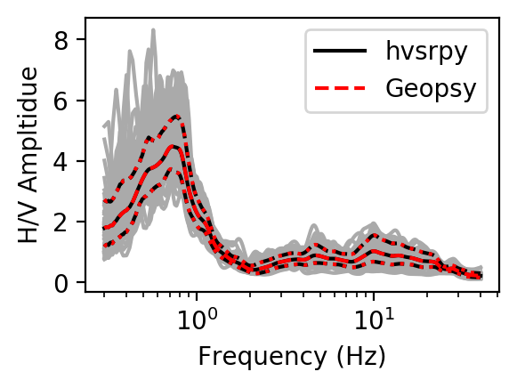

__File Name:__ _UT.STN12.A2_C50.miniseed_

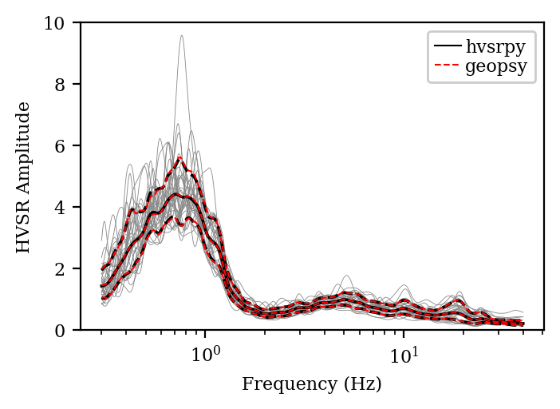

__File Name:__ _UT.STN12.A2_C150.miniseed_

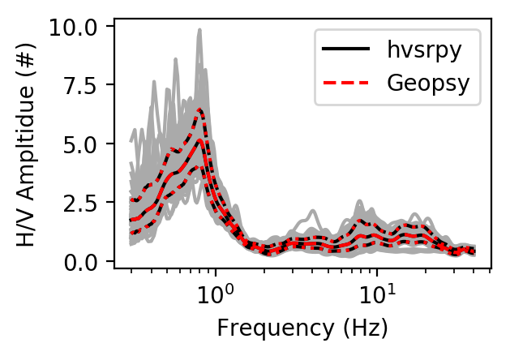

### Single Window

The examples in this section apply different settings to the same noise
record (_UT.STN11.A2_C50.miniseed_). For brevity, the default settings are
listed in the __Default Settings__ section, with only the variations from
these settings noted for each example.

#### Default Settings

- __Window Length:__ 60 seconds
- __Bandpass Filter:__ No
- __Tukey Window Length:__ 10% (i.e., 5% in Geopsy)
- __Konno and Ohmachi Smoothing Coefficient:__ 40
- __Resampling Center Frequencies:__
    - __Minimum:__ 0.3 Hz
    - __Maximum:__ 40 Hz
    - __Number:__ 2048
    - __Type:__ 'log'
- __Method for Combining Horizontal Components:__ 'squared-average'
- __Distribution for f0 from Time Windows:__ 'normal'
- __Distribution for Mean Curve:__ 'lognormal'

#### Single Window Results

__Default Case:__ No variation from those settings listed above.

__Window Length:__ 120 seconds.

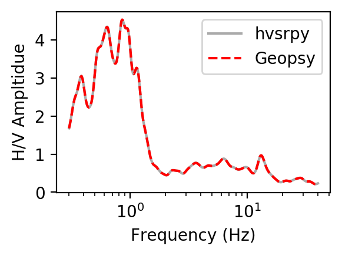

__Cosine Taper Width:__ 20 % (i.e., 10 % in Geopsy)

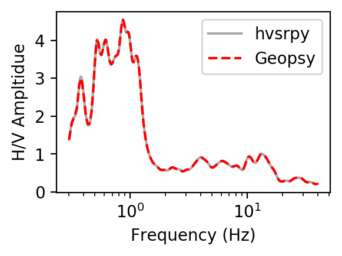

__Cosine Taper Width:__ 0.2 % (i.e., 0.1 % in Geopsy)

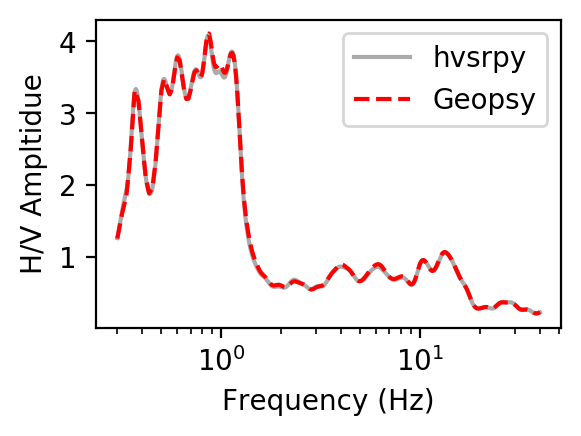

__Konno and Ohmachi Smoothing Coefficient:__ 10

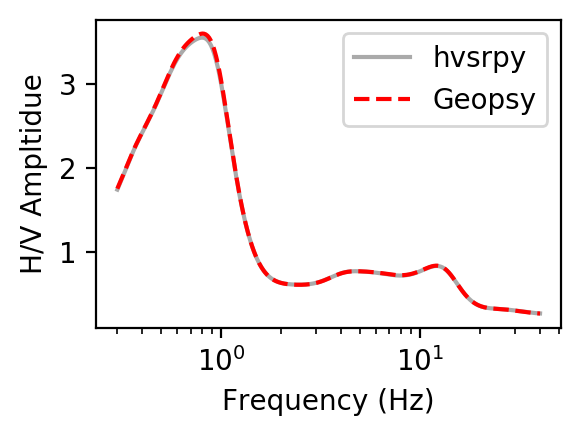

__Konno and Ohmachi Smoothing Coefficient:__ 80

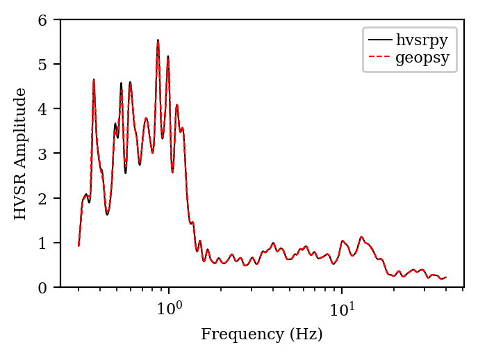

__Number of Points:__ 512

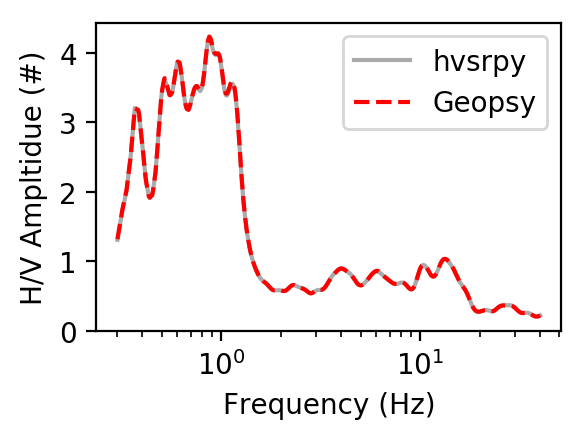

__Number of Points:__ 4096

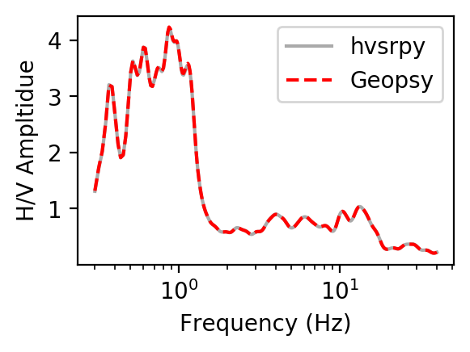
